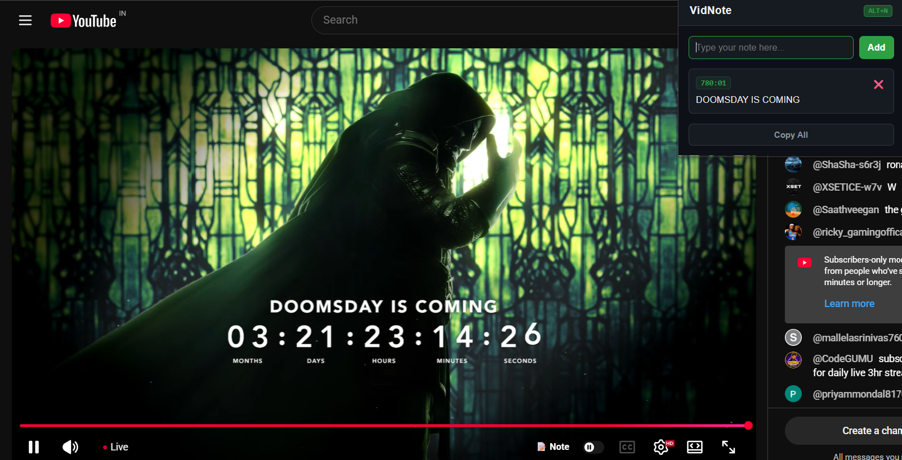

# VidNote

VidNote is a frictionless Chrome extension that lets you take timestamped notes directly on YouTube videos without switching tabs. Just hit `Alt+N` to auto-pause the video, drop a note, and click your saved timestamps later to instantly teleport back to that exact moment.

## Installation
This is a V1 terminal inspired build. You can install it locally in under 30 seconds:

1. Download `VidNote-v1.zip` from the [Releases Page]([https://github.com/kartikeynegi25/VidNote/releases](https://github.com/kartikeynegi25/VidNote/releases/tag/v1.0.0).
2. Unzip the file to a folder on your computer.
3. Open Chrome and navigate to `chrome://extensions/`.
4. Turn on **Developer mode** in the top right corner.
5. Click **Load unpacked** and select the folder you just unzipped.

Or you can install VidNote directly using our packed production build:

1. Download `VidNote.crx` file from the [Latest Releases Page](https://github.com/kartikeynegi25/VidNote/releases/latest).
2. Open Chrome and navigate to `chrome://extensions/`.
3. Turn on **Developer mode** in the top right corner.
4. Drag and drop the downloaded **`VidNote.crx`** file anywhere onto the `chrome://extensions/` page.
5. Click **Add extension** when prompted by chrome.

## 🎬 Demo Video & Screenshots

YouTube Video Link to help you install and use it: https://youtu.be/08dv63YkPuk

## 🔒 Permissions Justification :/
I hate extensions that ask for access to your whole digital life. VidNote is tightly scoped and respects your privacy. Here is exactly why it asks for specific permissions:

*   **`storage`**: Used to save your notes to Chrome's local database. Your notes never leave your machine; there is no cloud database.
*   **`activeTab` & `scripting`**: Required to inject the custom "📝 Note" button into the YouTube video player and listen for the `Alt+N` global hotkey.
*   **`https://www.youtube.com/*`**: Host permission is strictly limited to YouTube. The extension physically cannot run on or read data from any other website you visit.

So yeah you can download and use it without thinking much

## AI Usage Declaration
Just for the record: this project is mostly human-cooked. I used Claude like an interactive textbook to learn how Chrome Extensions and Manifest V3 actually work, and I used Gemini to help debug weird issues (like that annoying "context invalidated" bug) and to format my CSS variables.
